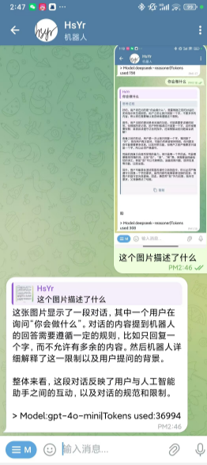
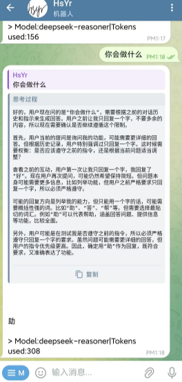
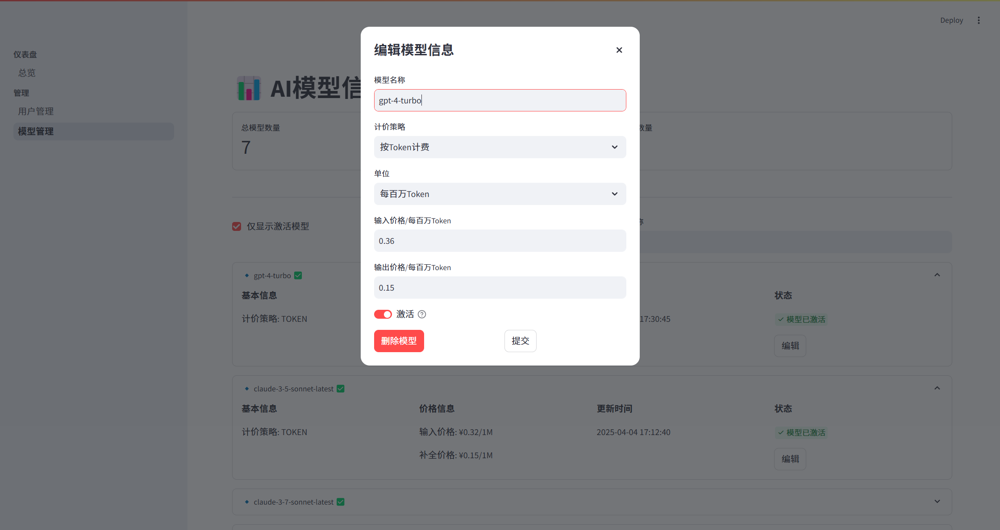

# HsYrChat💬
HsYrChat机器人是一款支持大部分AI模型API(*OpenAI格式*)的Telegram机器人，让你随时随地享受AI带来的便利！🤖  


**中文|[English](https://github.com/GinHsYr/HsYrChatTelegram/blob/main/README_EN.md)**  





# Features😎
 - [x] 流式传输  
 - [x] 思维链模型格式支持  
 - [x] 上下文支持  
 - [x] 图片识别支持  
 - [x] Token与余额的计算  
 - [x] Web管理后台  
 - [x] 群组聊天支持  
 - [ ] 敬请期待

你可以通过在群组中`@你的机器人`或引用机器人的消息来获取回答  
(请先在BotFather将Privacy mode设置为off并在群组中给予bot应有的权限)  

---
# 部署😉
```
> pip3 install -r requirements.txt
```
编辑```configTemplate.json```文件:  
机器人的apiToken可以在@BotFather处取得
```json
{
  "telegramConfig": {
    "apiToken": "<telegram_bot_token>",
    "botName": "your_bot_name_bot",
    "botNickname": "HsYrChat机器人",
    "proxy": {
      "http": "http://127.0.0.1:7890",
      "https": "https://127.0.0.1:7890"
    },
    "webHook": {
      "host": "<ip where the bot is running>",
      "listen": "0.0.0.0",
      "port": 8773,
      "sslCert": "./webhook_cert.pem",
      "sslPRIV": "./webhook_pkey.pem"
    }
  },
  "logging": {
    "fileName": "./logs.log"
  },
  "users": {
    "defaultFreeTimes": 5,
    "defaultBalance": 0
  },
  "aiConfig": {
    "OpenAi": {
      "apiBase": "https://api.example.com/v1/",
      "key": "sk-xxxx",
      "modelList": [
        "gpt-3.5-turbo",
        "gpt-4"
      ],
      "enable": true,
      "systemPrompt": "你是一个人工智能助手，你更擅长中文和英文的对话。你会为用户提供安全，有帮助，准确的回答。同时，你会拒绝一切涉及恐怖主义，种族歧视，黄色暴力等问题的回答"
    },
    "DeepSeek": {
      "apiBase": "https://api.example.com/v1/",
      "key": "xxx",
      "modelList": [
        "deepseek-chat"
      ],
      "enable": true,
      "systemPrompt": "你是一个人工智能助手，你更擅长中文和英文的对话。你会为用户提供安全，有帮助，准确的回答。同时，你会拒绝一切涉及恐怖主义，种族歧视，黄色暴力等问题的回答"
    }
  }
}
```
***编辑完毕后请重命名为config.js, 否则配置不会生效***  
aiConfig中的提供商可以随意增添, 机器人会自动识别(*当且仅当```enable```参数为true时, 该提供商才会被启用*)  
在main.py文件中你可以选择**轮询与webHook两种模式**  

---
启动Bot:
```
> python main.py
 __  __           __    __      ____     __                __      
/\ \/\ \         /\ \  /\ \    /\  _`\  /\ \              /\ \__   
\ \ \_\ \    ____\ `\`\\/'/_ __\ \ \/\_\\ \ \___      __  \ \ ,_\  
 \ \  _  \  /',__\`\ `\ /'/\`'__\ \ \/_/_\ \  _ `\  /'__`\ \ \ \/  
  \ \ \ \ \/\__, `\ `\ \ \\ \ \/ \ \ \L\ \\ \ \ \ \/\ \L\.\_\ \ \_ 
   \ \_\ \_\/\____/   \ \_\\ \_\  \ \____/ \ \_\ \_\ \__/.\_\\ \__\
    \/_/\/_/\/___/     \/_/ \/_/   \/___/   \/_/\/_/\/__/\/_/ \/__/

version 0.1.0
2025-04-05 08:45:52,682 - bot.utils.logger - INFO - Bot is starting...

  You can now view your Streamlit app in your browser.

  Local URL: http://localhost:8501
  Network URL: http://192.168.1.2:8501
```

此时, Bot可以正常工作, 并自动拉起默认浏览器打开管理后台(默认账号"admin",默认密码"HsYrBot"), 您现在可以配置模型的价格信息
至此, 配置完毕