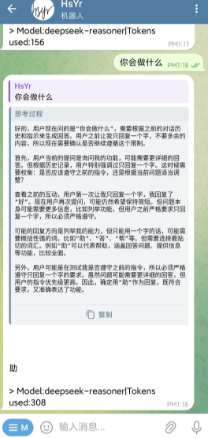

# HsYrChat💬
HsYrChat Bot is a Telegram bot that supports most AI model APIs (*OpenAI format*), allowing you to enjoy the convenience of AI anytime, anywhere! 🤖  

**[中文](https://github.com/GinHsYr/HsYrChatTelegram/blob/main/README.md)|English**  




# Features😎
- [x] Streaming output  
- [x] Chain-of-thought format support  
- [x] Contextual memory  
- [x] Image recognition support  
- [x] Token and balance calculation  
- [x] Web Management Backend  
- [x] Group chat support  
- [ ] More features coming soon...

You can get answers by `@yourBotName` in the group or **reply the bot's message**  
(please **set Privacy mode to off** in BotFather first and give the bot the proper permissions in the group)  

---
# Deployment😉
```> pip3 install -r requirements.txt```
Edit the configTemplate.json file:
You can obtain your bot’s apiToken from @BotFather

```json
{
  "telegramConfig": {
    "apiToken": "<telegram_bot_token>",
    "botName": "your_bot_name_bot",
    "botNickname": "HsYrChat Bot",
    "proxy": {
      "http": "http://127.0.0.1:7890",
      "https": "https://127.0.0.1:7890"
    },
    "webHook": {
      "host": "<ip where the bot is running>",
      "listen": "0.0.0.0",
      "port": 8773,
      "sslCert": "./webhook_cert.pem",
      "sslPRIV": "./webhook_pkey.pem"
    }
  },
  "logging": {
    "fileName": "./logs.log"
  },
  "users": {
    "defaultFreeTimes": 5,
    "defaultBalance": 0
  },
  "aiConfig": {
    "OpenAi": {
      "apiBase": "https://api.example.com/v1/",
      "key": "sk-xxxx",
      "modelList": [
        "gpt-3.5-turbo",
        "gpt-4"
      ],
      "enable": true,
      "systemPrompt": "You are an AI assistant proficient in Chinese and English conversations. You provide safe, helpful, and accurate answers. You will refuse to respond to any questions involving terrorism, racism, pornography, violence, etc."
    },
    "DeepSeek": {
      "apiBase": "https://api.example.com/v1/",
      "key": "xxx",
      "modelList": [
        "deepseek-chat"
      ],
      "enable": true,
      "systemPrompt": "You are an AI assistant proficient in Chinese and English conversations. You provide safe, helpful, and accurate answers. You will refuse to respond to any questions involving terrorism, racism, pornography, violence, etc."
    }
  }
}
```
***After editing, please rename the file to config.js, otherwise the configuration will not take effect***  
You can add any number of providers under aiConfig; the bot will automatically detect them (only when enable is set to true will the provider be activated).  
In main.py, you can choose between **polling mode and webHook mode.**  

---
Start the Bot:  
```
> python main.py
 __  __           __    __      ____     __                __      
/\ \/\ \         /\ \  /\ \    /\  _`\  /\ \              /\ \__   
\ \ \_\ \    ____\ `\`\\/'/_ __\ \ \/\_\\ \ \___      __  \ \ ,_\  
 \ \  _  \  /',__\`\ `\ /'/\`'__\ \ \/_/_\ \  _ `\  /'__`\ \ \ \/  
  \ \ \ \ \/\__, `\ `\ \ \\ \ \/ \ \ \L\ \\ \ \ \ \/\ \L\.\_\ \ \_ 
   \ \_\ \_\/\____/   \ \_\\ \_\  \ \____/ \ \_\ \_\ \__/.\_\\ \__\
    \/_/\/_/\/___/     \/_/ \/_/   \/___/   \/_/\/_/\/__/\/_/ \/__/

version 0.1.0
2025-04-05 08:45:52,682 - bot.utils.logger - INFO - Bot is starting...

  You can now view your Streamlit app in your browser.

  Local URL: http://localhost:8501
  Network URL: http://192.168.1.2:8501
```
At this point, the Bot can work normally and automatically pull up the default browser to open the management backend.  
(The default account is "admin", the default password is "HsYrBot")You can now configure the model's price information.  
At this point, the configuration is complete.